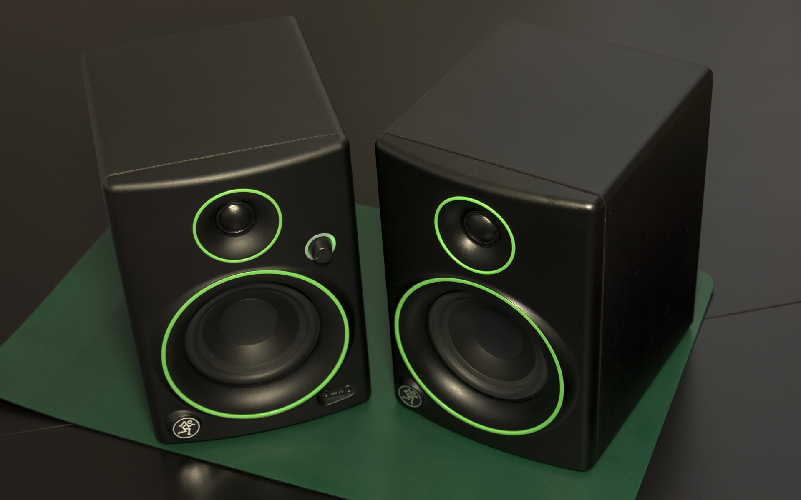
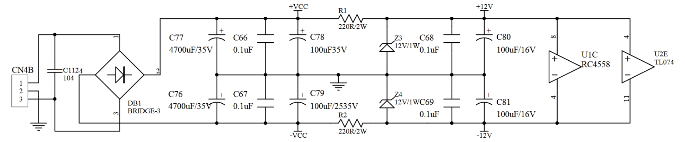
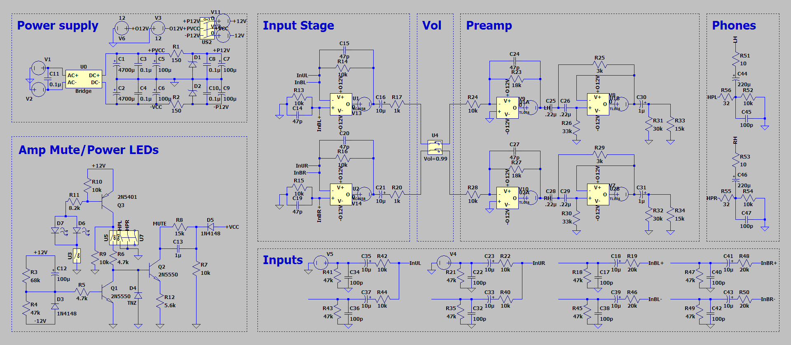

# Repairs - Mackie CR4 Speakers

## Fault Summary

After five years of trouble-free operation my speakers started emitting interference noise.
This was almost imperceptible at first, but the noise gradually got louder over a few months. It was also
present when listening to headphones plugged in to the powered speaker, but not when they were directly
connected to the source.

In addition, the speakers started emitting a loud "pop" as they were switched off.

## Research

Looking online, I found reports of two common faults with this product.

One issue is noise caused by a bad connection in the position select switch[^1]. This switch sets which side the powered
speaker is on (for correct stereo output). The position select switch on my unit seemed to have an equally good connection
in either position, and touching the switch didn't affect the noise level. Also, the position select switch
only affects the speakers, not the headphone output. Hearing the same interference through headphones meant this probably
wasn't the issue affecting my speakers.

The other common problem is a failing ±12V power supply[^2]. Zener diode shunt regulators are used to supply the power
amplifier's standby circuit, amongst other things. Under light load the diodes need to sink a high current, which overheats
them and the neighbouring circuitry. Over time the heat damage accumulates, and the power supply's output voltages sag towards
zero. When the voltages are insufficient for the standby circuit it mutes the power amplifier, meaning only the headphone output
is functional.

While the reported symptoms of the latter fault didn't match the issue with my speakers, it seemed worth looking into.

## Inspection

Opening up the powered speaker revealed that the ±12V power supply had indeed been overheating.

Here you can see the charred area of the PCB near the diodes Z3 and Z4:

[")](Images/BeforeFront.jpg)

With the PCB backlit, the extent of the damage is visible (image mirrored to match the one above):

[")](Images/BeforeBack.jpg)

I also checked the output voltages of the shunt regulators. The negative rail was at -9.4V, and the Zener diode leads
were hot enough to melt the plastic parts of the test clips!

While it was clear that the power supply had been damaged by overheating, it wasn't certain that this was the source
of the noise. It seemed plausible, but noisy output hadn't been mentioned as a symptom of the failing power supply. I
decided to investigate repairing the power supply anyway, just in case.

## Next Steps

The recommended fix is replace the shunt regulators with linear regulators (7812/7912) on a separate board[^2][^3].
That wouldn't be too difficult, were it not for the cramped enclosure and the need to adequately heatsink the
regulators. Mounting them to the existing heatsink requires insulating sheets and non-conductive mounting hardware.

Since this was a speculative fix I wanted an easier way to confirm that the power supply damage was causing the
noise. I decided to take a look at the schematic in the hope of finding an alternative.

## Checking the Schematic

As the product had been discontinued, the schematic was no longer available for download from the Mackie website.
I emailed Mackie support to request it, and they were happy to send me a copy.

Comparing it with the actual board, I noticed that the series resistor values didn't match. The design called for
220Ω resistors, but the board has 100Ω:

That allows more current to be drawn from the power supply if needed, but significantly increases heat output.

Perhaps the schematic was updated to use 220Ω resistors once the overheating issue was found. On the other 
hand, maybe the schematic is outdated and the resistance was reduced to 100Ω because the output current was 
insufficient. In either case changing the board to match the schematic would stop the overheating, but
in the latter it could cause further problems.

Unfortunately the version labels on the product and schematic didn't clarify the situation; both are
marked "Rev: V1.0". There is an additional "Revision: A00" label on the back of the unit, but no
corresponding label on the schematic.

Being unsure of which design was "correct", I simulated the board in LTSpice to get a better understanding of
the current requirements:

As far as I could tell, the highest current was required when driving headphones at high volume. In particular,
only very low-impedance headphones were affected (the type of earbuds that are cheap enough to give away). My
headphones are around 32Ω so it probably wouldn't have been an issue. Nevertheless, I settled on replacing the
resistors with 150Ω ones to be safe.

## Repair

I ordered replacement 12V/1W Zener diodes to match the originals, and some 150Ω/2W resistors. The diodes were only
available in sets of 5, which is enough for two replacements. That should keep the power supply working for
another 10 years or so, even if the reduced current doesn't help.

I also added some 100uF electrolytic capacitors to the order in case the ones near the diodes needed replacing. 
I ended up replacing C80 and C81, as they were in the heat-affected area and easy to access.

[")](Images/AfterFront.jpg)

Here you can see that I've raised the diodes off the board a little in the hope of getting better airflow:

[")](Images/AfterSide.jpg)

This might just limit their ability to sink heat into the PCB, but I'd rather the diodes burned themselves out without 
cooking the board.

## Conclusion

After reconnecting the main PCB to the drivers and volume board, switching the speakers on confirmed the noise was gone!
Since the repair they've been in regular use for over a year[^4] with no noticeable issues.

[^1]: [jade.wtf/tech-notes/makie-cr4-switch](https://jade.wtf/tech-notes/makie-cr4-switch/)
[^2]: [www.mikrocontroller.net/articles/Mackie_Creative_Reference_CR3_CR4_Reparatur_Repair](https://www.mikrocontroller.net/articles/Mackie_Creative_Reference_CR3_CR4_Reparatur_Repair)
[^3]: [www.reddit.com/r/audio/comments/g3aalp/comment/g4qn50l](https://www.reddit.com/r/audio/comments/g3aalp/comment/g4qn50l/)
[^4]: I've also been more careful to avoid leaving them in standby, as that maximises the current through the diodes. 
